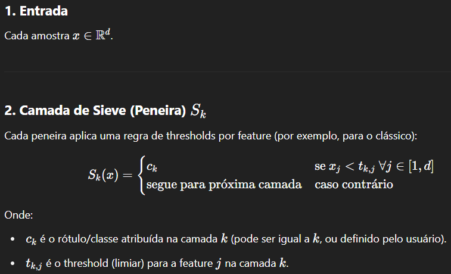

# MultiLayer Sieve

O **MultiLayer Sieve** é um algoritmo de classificação supervisionada inspirado no funcionamento físico das peneiras dos povos originários da Amazônia.

<p align="center">
  
</p>
 
---

## Algoritmo

É um classificador multicamadas, onde cada camada corresponde a uma peneira com thresholds (tamanhos dos buracos) aprendíveis e alta interpretabilidade.
Cada camada da peneira possui um conjunto de thresholds  de forma similar a malha de uma peneira física. As amostras são “triadas” camada por camada, de acordo com os thresholds de cada camada que são **ajustados automaticamente** para maximizar a performance nos dados de treino.

* Cada camada da peneira tem um threshold para cada feature numérica.
* Uma amostra é classificada em uma camada se todas as features forem menores que os thresholds daquela camada.
* Amostras não classificadas seguem para a próxima camada; quem não é classificado em nenhuma recebe a última classe.
* Os thresholds são aprendidos via busca em grade (`GridSearchCV`), garantindo flexibilidade e performance.
* O modelo pode ser salvo/carregado (persistência total) e é integrado ao estilo scikit-learn.

---

## Formalização

<p align="center">
  
</p>


## Vantagens

* **Explicável:** Decisões são 100% rastreáveis aos thresholds de cada camada.
* **Flexível:** Número de camadas, features e granularidade dos thresholds são facilmente ajustáveis.
* **Reutilizável:** Compatível com pipelines scikit-learn e persistência via joblib.
* **Aplicável em contextos de triagem, inspeção e separação de grupos bem definidos por faixas numéricas.**

---

## Justificativa e Aplicações

Embora exista uma grande variedade de algoritmos supervisionados para problemas lineares, como Regressão Logística, SVM linear, LDA e outros, o **MultiLayer Sieve** se destaca por sua proposta centrada em interpretabilidade, transparência e aderência a processos de decisão já praticados em ambientes industriais, médicos e corporativos.

### Por que propor o MultiLayer Sieve?

* **Interpretabilidade Total:**
  O MultiLayer Sieve transforma o processo de classificação em um conjunto claro de regras em cascata. Cada decisão pode ser explicada diretamente com base nos thresholds de cada camada, tornando o modelo auditável e compreensível por profissionais de qualquer área.

* **Aderência a Processos Reais:**
  Muitos fluxos de triagem e inspeção já utilizam regras de faixas e etapas sequenciais para tomada de decisão (ex: rejeição imediata, retrabalho, aprovação). O MultiLayer Sieve reflete e digitaliza fielmente esse raciocínio, facilitando aceitação e implantação.

* **Customização e Modularidade:**
  O algoritmo permite fácil personalização: número de camadas, ranges de thresholds, lógicas de decisão em cada etapa, e até a integração de modelos diferentes em cada camada.

* **Auditabilidade e Regulamentação:**
  Em setores regulados (saúde, indústria, finanças), a rastreabilidade da decisão é fundamental. O MultiLayer Sieve fornece explicações claras para cada classificação, atendendo requisitos de compliance e auditoria.

* **Simplicidade e Educação:**
  Por ser conceitualmente simples e visual, o MultiLayer Sieve é excelente para ensino, prototipagem e validação inicial de hipóteses, além de facilitar a colaboração entre cientistas de dados e especialistas do domínio.

### Possíveis Aplicações

* **Inspeção e Controle de Qualidade Industrial:**
  Classificação de peças/produtos conforme faixas de medidas, testes físicos ou padrões normativos.

* **Triagem Médica ou Laboratorial:**
  Priorização de casos, alertas de urgência e separação de grupos de pacientes com base em exames e sinais clínicos.

* **Análise e Concessão de Crédito:**
  Segmentação de propostas em categorias de risco segundo critérios objetivos (faixas de renda, idade, score, etc.).

* **Agronegócio:**
  Classificação de produtos agrícolas conforme padrões de tamanho, peso, umidade, pureza, etc.

* **Qualquer contexto onde regras claras por faixas e etapas sejam valorizadas ou exigidas.**


O MultiLayer Sieve não busca substituir métodos lineares clássicos, mas sim **preencher um nicho de aplicabilidade onde a explicação, a aderência ao processo e a transparência são mais importantes que a complexidade matemática ou a última fração de acurácia**.
Sua principal força reside na facilidade de auditoria, adaptação a processos já existentes e ganho de confiança por parte dos usuários finais.

---

## Instalação

Basta copiar o arquivo `MultiLayerSieve.py` para o seu projeto Python.
É necessário ter `numpy`, `pandas` e `scikit-learn` instalados.

```bash
pip install numpy pandas scikit-learn joblib
```

## Hiperparâmetros

O MultiLayer Sieve possui alguns hiperparâmetros que controlam sua lógica, flexibilidade e desempenho. Entender e ajustar esses parâmetros é fundamental para obter bons resultados e garantir interpretabilidade.
Abaixo, explicamos cada um deles:

* **n_layers**: número de camadas (“peneiras”) empilhadas no modelo.
    O que faz: cada camada representa uma etapa de triagem, com thresholds próprios para cada feature.
    Quanto mais camadas, mais refinada pode ser a separação entre classes.
    Quando aumentar/diminuir: use mais camadas se seu problema tiver múltiplas faixas de classificação (ex: rejeitado, retrabalho, aprovado).
    Use menos para casos binários ou mais simples.

* **feature_ranges**: dicionário com o intervalo de valores a serem testados como thresholds para cada feature ({feature_name: array_de_valores}).
   O que faz: permite customizar a busca dos melhores thresholds para cada feature.
   Quando usar: se quiser controlar os possíveis valores de thresholds (por exemplo, para priorizar faixas específicas ou acelerar a busca).

* **n_thresholds**: quantidade de valores a serem gerados automaticamente para cada feature ao criar os ranges de thresholds.
   O que faz: define a granularidade da busca.
   Valores mais altos → thresholds mais precisos, porém busca mais lenta
   Valores mais baixos → thresholds menos precisos, mas busca mais rápida
    
    Dica:
    Ajuste conforme o tamanho do seu dataset e o poder computacional disponível.
---

## Exemplo de Uso

### Treinamento

```python
import pandas as pd
from sklearn.model_selection import GridSearchCV
from learnable_sieve import LearnableMultiLayerSieve
import joblib

df = pd.read_csv('treino.csv')
X = df[['glicose', 'pressao', 'temperatura']].values
y = df['classe_verdadeira'].values

clf = MultiLayerSieve(
    n_layers=2,
    feature_names=['glicose', 'pressao', 'temperatura'],
    n_thresholds=10
)
clf.fit(X, y)                # Gera os ranges automaticamente!
param_grid = clf.get_param_grid()
grid = GridSearchCV(clf, param_grid, scoring='accuracy', cv=2)
grid.fit(X, y)

joblib.dump(grid.best_estimator_, 'modelo_sieve.pkl')
```

### Teste e Avaliação

```python
import pandas as pd
import joblib

modelo = joblib.load('modelo_sieve.pkl')
df_teste = pd.read_csv('teste.csv')
X_teste = df_teste[['glicose', 'pressao', 'temperatura']].values
y_pred = modelo.predict(X_teste)

from sklearn.metrics import classification_report, confusion_matrix
if 'classe_verdadeira' in df_teste.columns:
    print(classification_report(df_teste['classe_verdadeira'], y_pred))
```

---

## Estrutura dos arquivos

* `MultiLayerSieve.py` — Implementação do classificador MultiLayer Sieve.
* `Train.py` — Exemplo de script de treinamento.
* `Test.py` — Exemplo de script de teste/avaliação.
* `treino.csv`, `teste.csv` — Dados de exemplo (colunas: features numéricas + classe).

---

## Limitações

* **Não recomendado para relações altamente não-lineares**.
* GridSearch pode ser custoso para muitos features/camadas/thresholds.
* Melhor desempenho em problemas interpretáveis, datasets pequenos/médios ou prototipagem rápida.

---


## 📘 Créditos

📘 **Transformer Core** foi desenvolvido pelo Prof. [Fabio Santos](https://www.linkedin.com/in/fabio-santos-3706906/) da Universidade do Estado do Amazonas.


## Contribuindo

Sinta-se livre para propor melhorias, sugerir issues, ou criar pull requests para:

* Outras funções de decisão por camada (ex: operadores diferentes de `<`)
* Suporte a mais tipos de dados
* Integração com mais pipelines

---

## Licença

MIT

---

> Dúvidas, sugestões ou exemplos de uso? Abra uma issue ou entre em contato!

